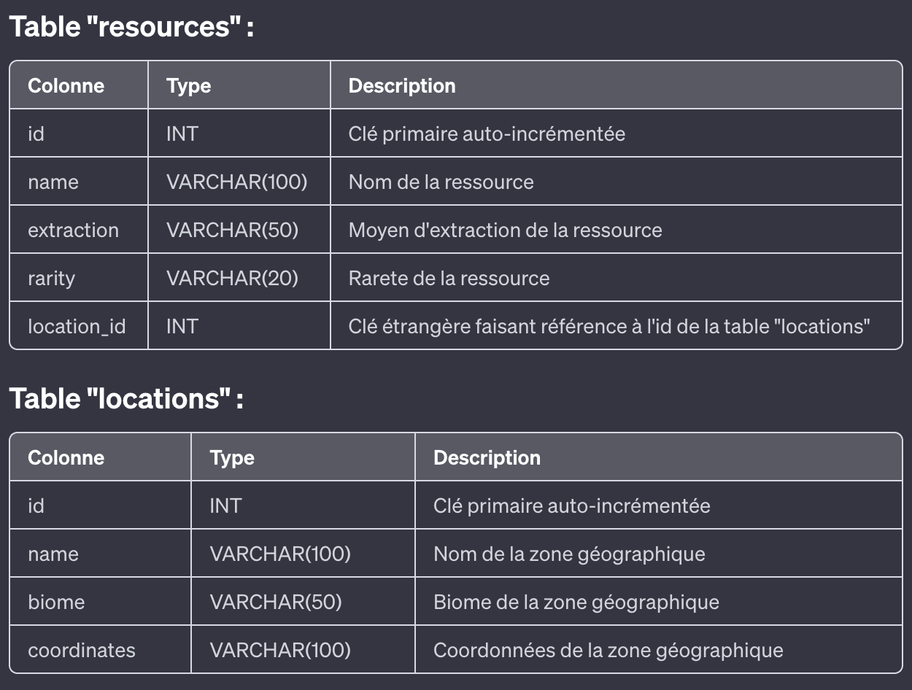

## **Partie 1: Setup initial**

1. **Base de données**
   1. Créez une base de données nommée "MinecraftResourcesDB".
   2. Définissez plusieurs tables pour stocker les ressources en fonction de critères tels que le lieu d'extraction, la rareté, le moyen d'obtention, etc.
1. **Structure du projet**
   1. Créez une arborescence de fichiers avec au moins quatre pages : accueil, ajout de ressources, modification et suppression de ressources.
   2. Intégrez Bootstrap pour le design.  
  

## **Partie 2: Backend - PHP avec PDO**

3. **Connexion à la base de données**
   1. Écrivez un script PHP pour établir la connexion à la base de données en utilisant PDO.
3. **CRUD de base**
   1. Créez des scripts PHP pour effectuer les opérations CRUD sur les différentes tables de la base de données.
   2. Commencez par des requêtes simples pour ajouter, lire, mettre à jour et supprimer des ressources.  

  

## **Partie 3: Frontend - HTML, CSS, JavaScript**

5. **Page d'accueil**
   1. Créez une page d'accueil attrayante qui affiche une liste de toutes les ressources disponibles. Utilisez Bootstrap pour organiser et styliser cette liste.
   2. Ajoutez des fonctionnalités de tri et de filtrage pour permettre aux utilisateurs de trouver rapidement les ressources qu'ils recherchent.
5. **Ajout de ressources**
   1. Créez une page pour ajouter de nouvelles ressources à la base de données. Utilisez un formulaire HTML avec des champs appropriés pour saisir les informations sur la ressource.
   2. Utilisez JavaScript pour valider les données du formulaire avant de les soumettre au serveur.
5. **Modification et suppression de ressources**
   1. Créez des pages distinctes pour permettre aux utilisateurs de modifier et de supprimer les ressources existantes. Utilisez des modals Bootstrap pour afficher les formulaires de modification et de confirmation de suppression.
5. **Gestion des images**
   1. Ajoutez des fonctionnalités pour permettre aux utilisateurs d'ajouter des images associées à chaque ressource.
   2. Stockez les chemins d'accès des images dans la base de données et assurez-vous qu'elles sont correctement affichées sur la page.  

  
## **Partie 4: Requêtes avancées SQL**

9. **Requêtes avec jointures**
   1. Proposez des exercices qui mettent en pratique les jointures SQL pour récupérer des données à partir de plusieurs tables liées.
  
## **Ressources supplémentaires**

1. **Minecraft Wiki** - La ressource principale pour tout ce qui concerne Minecraft, offrant des informations détaillées sur les ressources, les crafts, les mobs et bien plus encore.
   1. Site web : [Minecraft Wiki](https://fr.minecraft.wiki/)
1. **Minecraft ID List** - Une liste complète des identifiants pour les blocs, objets, mobs et entités dans Minecraft. Utile pour la création de bases de données ou de références.
   1. Site web : [Minecraft ID List](https://minecraft-ids.grahamedgecombe.com/)  
1. **Minecraft Crafting Guide** - Un guide détaillé des crafts dans Minecraft, montrant comment fabriquer différents objets et blocs à partir de ressources.
   1. Site web : [Minecraft Crafting Guide](https://minecraftcraftingguide.net/)
1. **Minecraft Blocks & Items Database** - Une base de données interactive des blocs et objets disponibles dans Minecraft, avec des informations sur leur utilisation et leurs propriétés.
   1. Site web : [Minecraft Blocks & Items Database](https://minecraftitemids.com/)
1. **Minecraft Tools & Weapons Database** - Une base de données qui répertorie les outils et les armes disponibles dans Minecraft, avec des détails sur leurs statistiques et leurs recettes.
   1. Site web : [Minecraft Tools & Weapons Database](https://minecraft.tools/en/command-15456-weapons)   

### **Exemple **

